## Step 12 — Create the floci AWS CLI profile


What the command does

- aws configure set <key> <value> --profile <name> writes one setting into the profile files, creating them if needed. Credentials go to ~/.aws/credentials, everything else to ~/.aws/config.
- endpoint_url is the line that redirects all services in this profile to Floci. Without it the CLI would contact real AWS.
- test/test are dummy credentials. Floci accepts any non-empty values by default


```
aws configure list --profile floci
```


Read the output

Account = 000000000000 — Floci's fixed dummy account number. Real AWS accounts are real 12-digit numbers. Seeing all zeros is your proof you are not on real AWS.
Arn — an Amazon Resource Name, explained fully in Step 16.


## Step 14 — Prove isolation from real AWS, and prove persistence
14.2 Isolation, Test 2 — inspect the actual URL the CLI used


14.3 Isolation, Test 3 — stop the container


14.4 Persistence — the test that actually matters


Clean up the marker & 14.5 Exit codes


**Floci Limitation — identity is not really authenticated**
    
    Real AWS verifies your signature cryptographically and rejects wrong credentials. Floci accepts any non-empty credentials by default, and reports you as the account root user. So get-caller-identity in Floci confirms connectivity, not authentication.

## Step 15 — Storage diagnostics, README, and commit Part A


# PART B — Building the IAM Foundation (Steps 16–33)

## Step 16 — IAM concepts and the anatomy of an ARN
#### Purpose
Understand the vocabulary before typing commands. Five minutes here saves an hour of confusion later.

#### Floci Limitation — policies are stored, not enforced (by default)

    This is the most important Floci caveat in this lab.

    Real AWS evaluates every request against IAM policies and returns AccessDenied when they do not permit it. Floci, by default, accepts any non-empty credentials and does not authorize requests against your IAM policies unless stricter authentication is explicitly enabled.

    What this means for you: everything you write in this lab is stored, retrievable and syntactically validated — you are learning real IAM authoring. But you generally will not see an AccessDenied in Floci simply because a policy was too narrow. Step 32 shows the policy simulator as the closest available substitute, and Section 12 lists exactly which parts of this lab are "conceptual / real AWS" rather than "enforced by Floci".

    Write every policy as if it were enforced. In a real account it will be.

## Step 17 — Inspect the empty IAM account


## Step 18 — Create the IAM groups


create-group creates an empty IAM group. A group has no permissions and no members at birth — it is purely a container. Note there is no --region: IAM is global.

verify
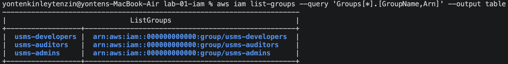

## Step 19 — Create the IAM users and capture their ARNs

Purpose

Create three users, and learn the single most important AWS CLI habit: never copy an ID by hand.

Concept: why capture output into variables

Copying arn:aws:iam::000000000000:user/usms-dev-01 by hand from the screen into the next command is slow and error-prone. Instead, ask the CLI for exactly one value and store it in a shell variable


Verify


## Step 20 — Add users to groups


## Step 21 — Explore and attach an AWS managed policy
Explore what is available


## Step 22 — Write your first customer managed policy


## Step 23 — Write the S3 data policy (used for real in Lab 4)
Write the policy that will govern student transcript storage, and get the bucket-vs-object ARN distinction right.

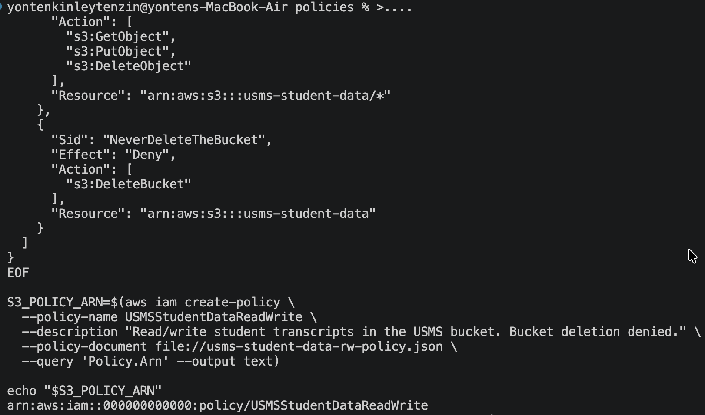

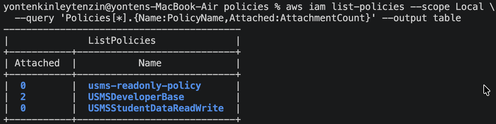

## Step 24 — Use --generate-cli-skeleton to discover parameters
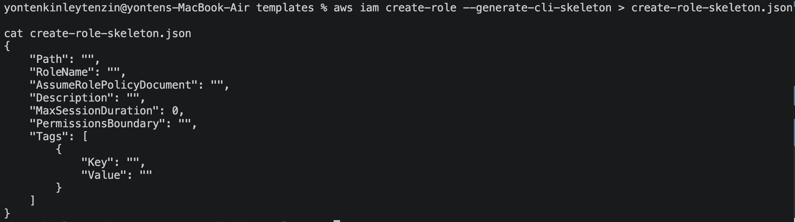

## Step 25 — Add an inline policy (self-service credentials)

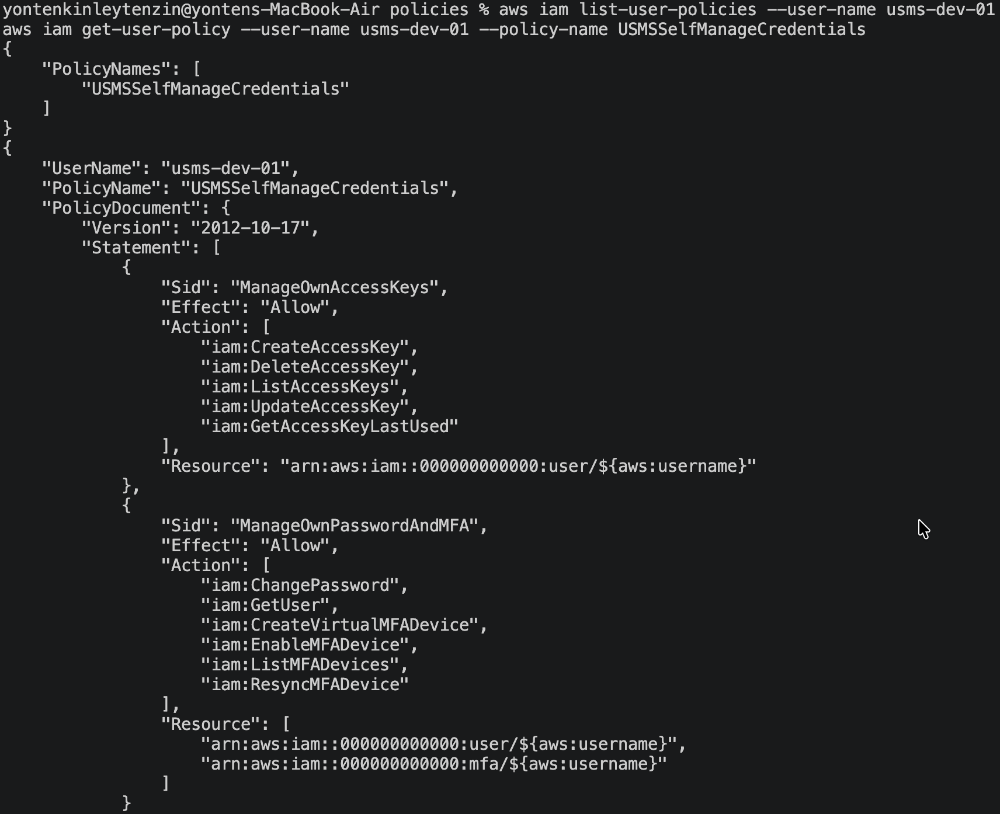

## Step 26 — Inspect what you have built
 A.Everything about one user
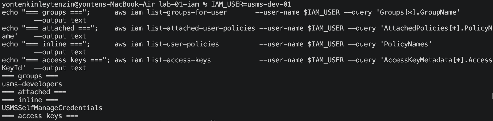

 B. Read the actual policy JSON back out
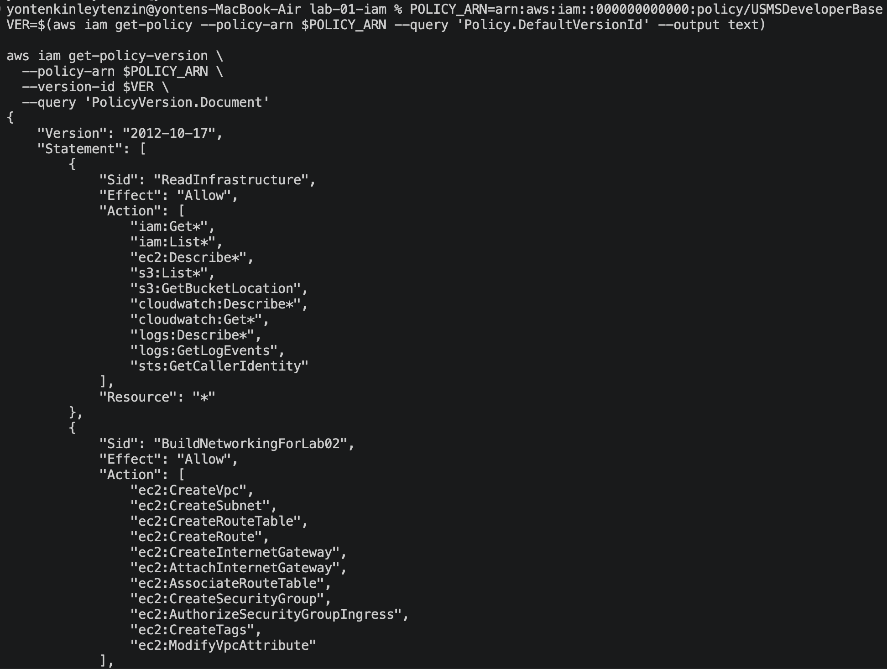

## Step 27 — Policy versions
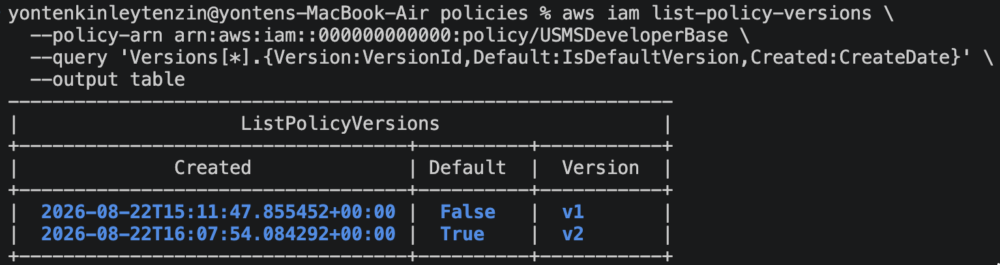

## Step 28 — Create a role for EC2, with a trust policy
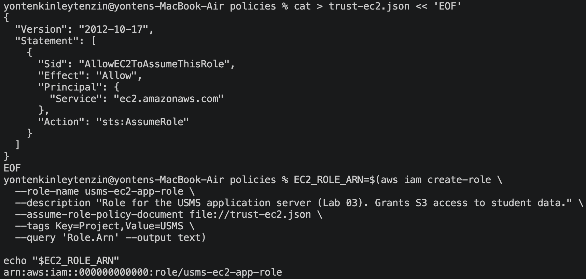

What the command does

--assume-role-policy-document is the trust policy — the "who may become me" document. This flag name is genuinely confusing; remember it is the trust policy, not the permissions policy.
The role starts with zero permissions. Trust and permissions are completely separate.


give permission 
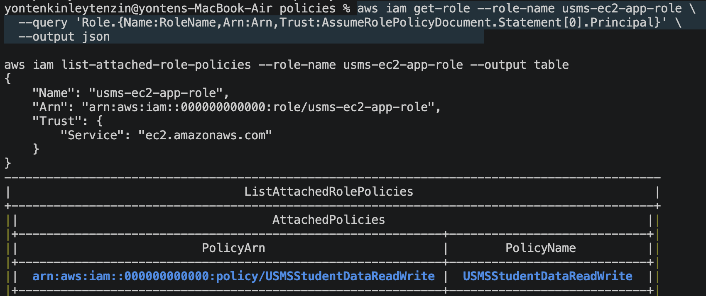

Create the instance profile & verify 
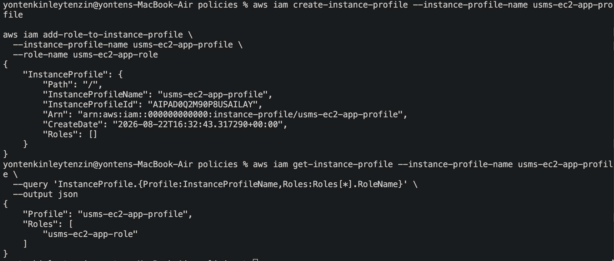

## Step 29 — Create the Lambda execution role
create lumbda function and verify 
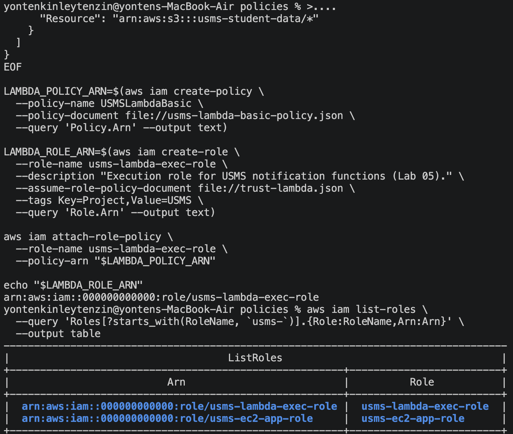

## Step 30 — A role for humans, and temporary credentials with STS
Create the role with an account-principal trust policy

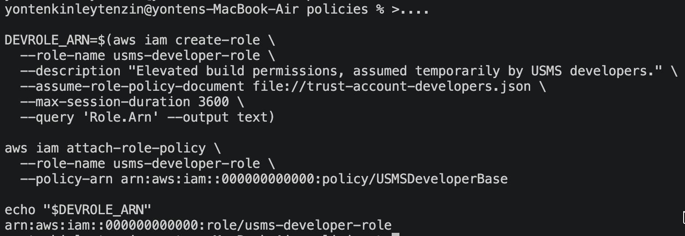

Give the developers group permission to assume it
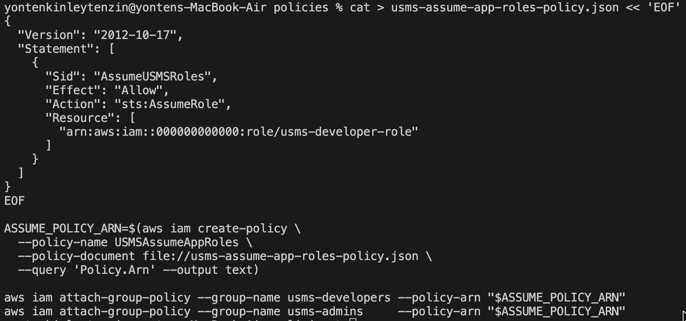

Assume the role
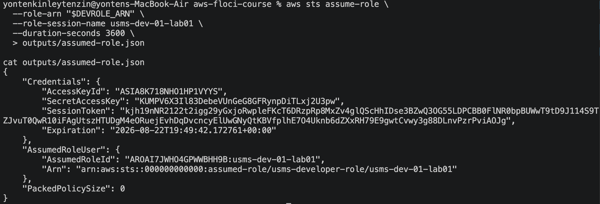

## Step 31 — Access keys, handled safely
Create programmatic credentials for usms-dev-01 and store them without ever risking a commit.
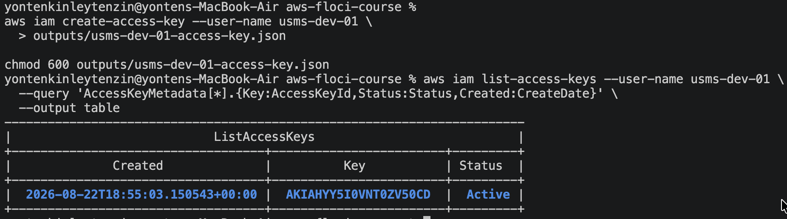

Confirm Git really is protecting you
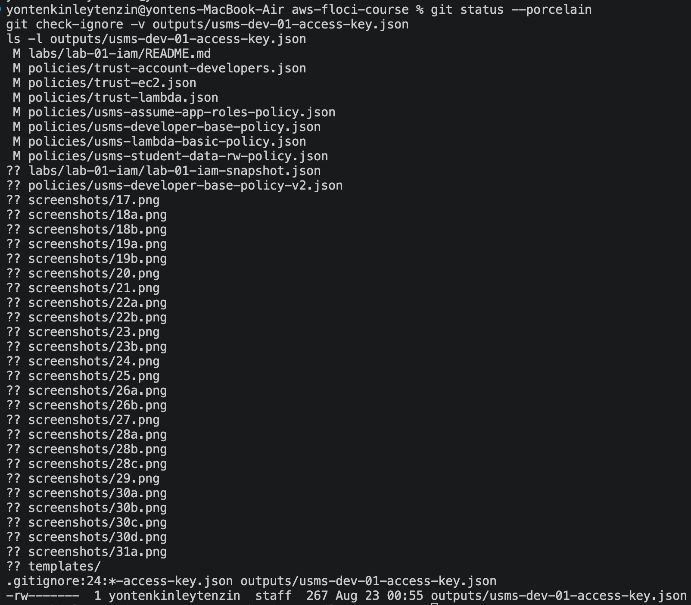

Create a second profile that uses this key
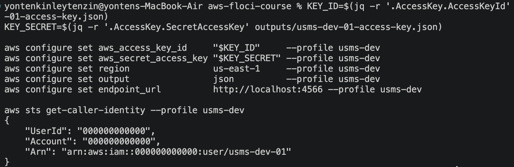

## Step 32 — Test permissions with the policy simulator
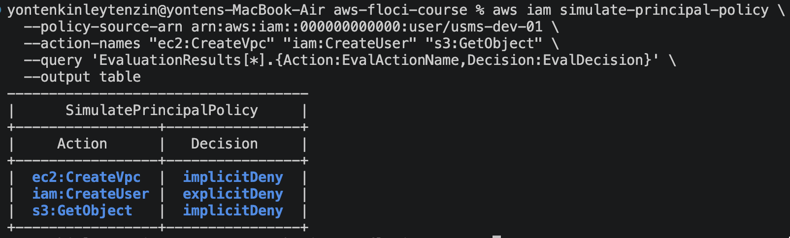

